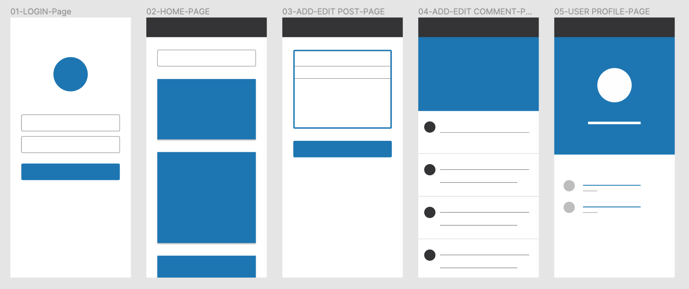

## Posts App

A simple [create-react-app](https://reactjs.org/docs/create-a-new-react-app.html) to display posts by users using [material-ui](https://mui.com/) and the [JSON Placeholder](https://jsonplaceholder.typicode.com/) API

### Wireframes

